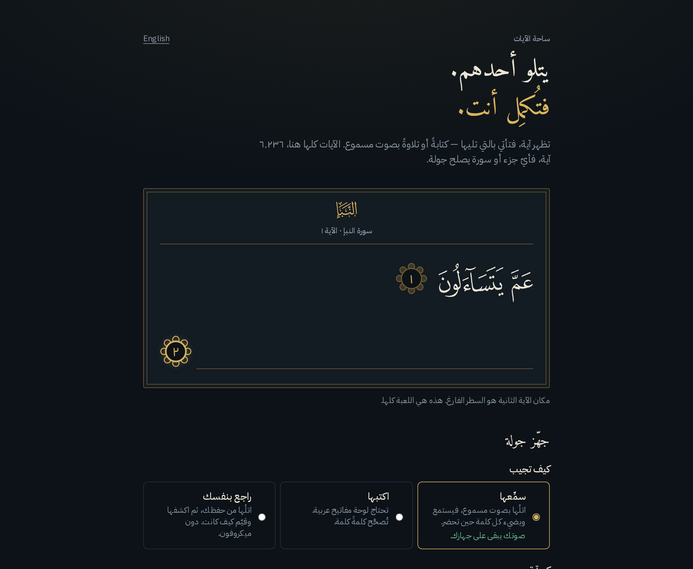

<div dir="rtl">

# ساحة الآيات

[English](README.md)

تطبيق ويب للتحدي في تلاوة القرآن: تظهر آية، فتأتي أنت بالتي تليها.



**المرحلة الأولى جاهزة وتعمل كاملة** — وضع التدريب الفردي على المصحف كله، أي جزء أو أي
سورة، كتابةً أو تلاوةً، مع التقييم ومراجعة كل جولة وملخّص في النهاية. أما المبارزات
وبطاقات النتائج والحِلَق ووضع المراجعة المتباعدة فلم تُبنَ بعد.

## التشغيل

يلزم Node إصدار 22.5 أو أحدث — يُحفظ تقدّمك عبر `node:sqlite` المدمج في Node، وهو غير
موجود قبل هذا الإصدار.

```bash
./start.sh            # خادم التطوير على http://localhost:3210
./start.sh --prod     # بناء الإنتاج، ثم تشغيله كما يُنشر
./stop.sh             # إيقاف ما شغّلته
```

يعمل الخادم في جلسة خاصة به، فإغلاق الطرفية لا يوقفه، وسجلّه في `.run/server.log`.
وإن أردت تشغيله بنفسك: `npm install` ثم `npm run dev`.

نصّ القرآن مُحمَّل مرة واحدة ومحفوظ في `data/`، فلا مفتاح واجهة برمجية ولا أي اتصال
بالشبكة أثناء التشغيل. الآيات الـ 6,236 كلها موجودة؛ ولتحديثها:

```bash
npm run fetch:quran
```

ويمكن تمرير أرقام السور لتحديث بعضها فقط (`npm run fetch:quran -- 2 112`)، ويُعاد بناء
الفهرس من كل ملفات السور الموجودة على القرص في الحالتين.

يُحفظ تقدّمك في `.data/ayah-arena.db` (SQLite، وهو خارج المستودع) — احذفه لتبدأ من جديد.

## الفحوصات والاختبارات

```bash
npm run verify
```

فحص الأنواع، وESLint، وفحص البيانات على المصحف كله، واختبارات الوحدات، وبوابة Skylos،
وفحص أمان الاعتماديات، واختبارات التكامل — بهذا الترتيب، الأرخص أولًا. لا يحتاج متصفحًا
ولا يُنزّل شيئًا، فيبقى سريعًا بما يكفي لتشغيله قبل كل إيداع.

أما اختبارات المتصفح فمنفصلة لأنها تبني التطبيق وتُشغّل Chromium:

```bash
npm run test:e2e            # الرحلات والضمانات وإتاحة الوصول وتخطيط شاشة 375px
npm run test:e2e:listener   # مسار الميكروفون الحقيقي، بنموذج الاستماع الحقيقي
```

| الطبقة | ما تُشغّله | ما تلمسه |
|---|---|---|
| `npm run check` | التقييم والنطاقات على 6,236 آية | بيانات القرآن المحفوظة |
| `npm test` | اختبارات الوحدات (Vitest) | دوال خالصة فقط |
| `npm run test:integration` | معالِجات المسارات الحقيقية | SQLite حقيقي، قاعدة بيانات مؤقتة لكل اختبار |
| `npm run test:e2e` | Playwright، سطح المكتب و375px | بناء إنتاجي، بمجلد بيانات خاص به |
| `npm run test:e2e:listener` | Chromium مع تلاوة تُشغَّل في ميكروفون وهمي | النموذج الحقيقي على الجهاز، يُجلب مرة ويُخزَّن |

لا اختبار يتصل بالشبكة: الخطوة الوحيدة المتصلة في `verify` هي فحص الاعتماديات الذي يسأل
npm عن الثغرات المعلنة. أما مجموعة الاستماع فتجلب أول مرة شيئين مثبتين — تلاوة يُتحقق
منها بـ SHA-256، والنموذج عند إصدار محدد — إلى `.cache/` خارج المستودع. ولا يُودَع أي
منهما: التسجيل عملُ غيرنا، والنموذج مع ملفاته نحو 220 ميغابايت.

كل دفع وكل طلب سحب يُشغّل **الفحوصات السريعة** و**اختبارات المتصفح**. أما سير عمل
الاستماع فيُشغَّل ليليًا وعند الطلب، لأنه بطيء ويحتاج ذلك النموذج. والتحليل الساكن هو
[Skylos](https://github.com/duriantaco/skylos) مقابل خط أساس مُراجَع — كل نتيجة مقبولة
فيه مُبرَّرة يدويًا في `.skylos/REVIEW.md` — و`npm audit --omit=dev --audit-level=high`
هو بوابة أمان الاعتماديات.

## كيف يعمل

**النص.** `scripts/fetch-quran.mjs` وحده يتصل بواجهة
[Quran.com v4](https://api.quran.com/api/v4) (نسخة تنزيل)، فيجلب رسم المصحف والرسم
الإملائي والنص المجرّد لكل آية إلى `data/surah/<n>.json`، مع مصدر النص وتاريخ الجلب. وهو
يمرّ على كل صفحات الاستجابة ويتوقف بخطأ صريح إن اختلف العدد عن إجمالي الواجهة أو عن
بيانات السورة — فالنقص الصامت هو العطل الذي قد يمرّ دون أن يلحظه أحد. ولا يُولَّد نص آية
ولا يُعاد صوغه ولا يُعدَّل في أي موضع من هذا المشروع.

**التنظيم بالسور لا بالأجزاء.** الزوج في التدريب آيتان متتاليتان من *سورة واحدة* دائمًا،
فالسورة هي الوحدة التي يعمل بها التطبيق — وحدود الأجزاء تقطع السور (الجزء الثاني يبدأ في
وسط البقرة عند 2:142، و19 سورة تقع على حدّ جزء). وانتماء كل آية إلى جزئها محفوظ معها،
فيُشتق عرض الأجزاء في `data/index.json` من الملفات نفسها. وتُستدعى الآية بمفتاحها هي، لا
بالبحث داخل جزء قد لا تكون فيه كلها.

**الأزواج.** `buildPairs()` لا يجمع إلا آيتين من سورة واحدة ومتتاليتين، فآخر آية في كل
نطاق لا تُستعمل سؤالًا أبدًا. فلو جُمعت الآيات بالترتيب وحده لطُلب مطلعُ السورة التالية —
وهذا عمل آخر غير إتمام سياق واحد — ولتكرر ذلك كثيرًا في جزء عمّ بسوره القصيرة السبع
والثلاثين. والقاعدة نفسها تُبقي تدريب الجزء داخل جزئه.

**التقييم يقبل ثلاثة رسوم.** لوحة مفاتيح الهاتف لا تكتب رسم المصحف، والنص المجرّد يختلف
عن الإملائي في كثير من الآيات، فالرسوم الثلاثة كلها مقبولة ويُؤخذ أفضل نتيجة. لكن الآية
التي تُعرض عند المراجعة هي رسم المصحف دائمًا مهما كان ما كُتب: من يحفظ لا ينبغي أن يُردّ
عليه الجواب برسم لا يراه في مصحفه.

**ثلاث طرق للإجابة.** اكتبها (وتحتاج لوحة مفاتيح عربية)، أو سمِّعها والجهاز يستمع، أو
راجع بنفسك — تتلوها من حفظك، ثم تكشف الآية وتقيّم كيف كانت. والثالثة لا تحتاج ميكروفونًا
ولا تنزيلًا، وهي الطريقة التي يعمل بها التطبيق لمن لا يرغب أن يُسجَّل صوته أصلًا.

**الاستماع يجري على الجهاز.** بعد موافقة القارئ — تُطلب قبل تنزيل أي شيء — يُجلب نموذج
Whisper مُدرَّب على العربية القرآنية مرة واحدة ويعمل داخل المتصفح. وهو لسؤال واحد: أي
الكلمات المنتظرة عادت. لا يُرفع الصوت ولا يُحفظ، ويُقيَّم ما سُمع ثم يُهمل ولا يُعرض، ولا
تفعل النتيجة أكثر من ترجيح تقييم يملك القارئ تغييره. ولا يحكم على التجويد ولا على النطق،
ولا يُنشئ نصًا من عنده.

**الرفق في دالّة التقييم نفسها، لا في العبارات وحدها.** الكلمة التي تبعد تعديلًا واحدًا عن
المنتظر تنال 75% من الدرجة. والسرعة مكافأة فوق الحفظ الصحيح ولا تكون عقوبة أبدًا. ولا شيء
في الواجهة أحمر ولا مشطوب، ولا عدّاد أيام متتالية ولا تاريخ آخر نشاط في قاعدة البيانات —
من انقطع أسبوعًا لم يكسر شيئًا.

## البنية

```
data/surah/<n>.json       نص القرآن الموثّق ومصدره (محفوظ في المستودع)
data/index.json           بيانات السور والأجزاء للاختيار، مشتقة مما سبق
scripts/fetch-quran.mjs   الوحيد الذي يتصل بواجهة القرآن
scripts/check-scoring.ts  فحص التطبيع والتقييم على البيانات الحقيقية
src/lib/arabic.ts         التطبيع (للتقييم فقط — لا يمسّ ما يُعرض)
src/lib/score.ts          محاذاة الكلمات والدرجة الرفيقة
src/lib/quran.ts          تحميل البيانات وحل النطاقات وأزواج السؤال والجواب
src/components/ScopePicker.tsx   الاختيار بين 30 جزءًا و114 سورة
src/lib/drill.ts          إدارة الجولات، والقرار عند الخادم
src/lib/store.ts          كل التخزين، وهو الملف الوحيد الذي يمسّه الانتقال إلى Postgres
src/lib/listen/           الاستماع على الجهاز: التسجيل وعامل النموذج
src/lib/i18n.ts           القاموسان؛ واللغة محفوظة في كعكة
src/app/                  الرئيسية والتدريب والنتائج ومسارات الواجهة البرمجية
tests/integration/        معالِجات المسارات الحقيقية مع SQLite حقيقي
tests/e2e/                Playwright: الرحلات والضمانات وإتاحة الوصول والتخطيط
.github/workflows/        التكامل المستمر وسير عمل الاستماع
```

## قرارات تستحق المعرفة

- **Next.js 15 وSQLite عبر `node:sqlite` المدمج** — بلا وحدات أصلية وبلا قاعدة بيانات
  خارجية. كل الاستعلامات في `src/lib/store.ts`، فالانتقال إلى Postgres لاحقًا يعني إعادة
  كتابة ملف واحد.
- **لا حسابات بعد.** الهوية كعكة `httpOnly` مبهمة واحدة. لا شيء تسجّل الدخول إليه ولا شيء
  شخصي محفوظ.
- **الجواب لا يصل المتصفح قبل تسليم المحاولة.** القرآن ليس سرًّا، لكن جعل القرار عند
  الخادم هو ما يجعل المبارزات عادلة لاحقًا دون إعادة بناء هذه الطبقة.
- **كل محاولة تُسجَّل بـ `{mode, rawInput, selfGrade, accuracy, points, elapsedMs}`** —
  وهو تحديدًا ما يحتاجه طابور المراجعة المتباعدة، فلا يبدأ ببناء جديد للجداول.
- **اسم التبويب والشاشة الرئيسية "Arena" فقط.** كثيرون يتشاركون هاتفًا واحدًا.
- **لغتان، والاختيار في كعكة.** الإنجليزية والعربية (من اليمين لليسار، بأرقام عربية)، لا
  في المسار، حتى يفتح الرابط المُشارَك بلغة من يستقبله.
- **النموذج الوحيد يعمل على جهاز القارئ، ولمطابقة الكلمات فقط.** لا شيء هنا يولّد محتوى
  دينيًا من أي نوع — لا حكم على التجويد، ولا فتوى، ولا تفسير.

## ما هو قادم

بالترتيب الذي وضعه التصور: بطاقات نتائج قابلة للمشاركة، ثم المبارزات عبر رابط تحدٍّ، ثم
الحِلَق ولوحات المجموعات، ثم وضع المراجعة المتباعدة.

## مصدر النص

نص القرآن من [Quran.com](https://quran.com) (رسم المصحف من Tanzil.net)، وأسماء السور
وبياناتها من الواجهة نفسها.

## الرخصة

مجاني للاستعمال الشخصي والتعليمي وغير التجاري — انظر [LICENSE](LICENSE) للشروط كاملة.
أما الاستعمال التجاري فيحتاج إذنًا خطيًا منفصلًا من صاحب الحقوق.

</div>
