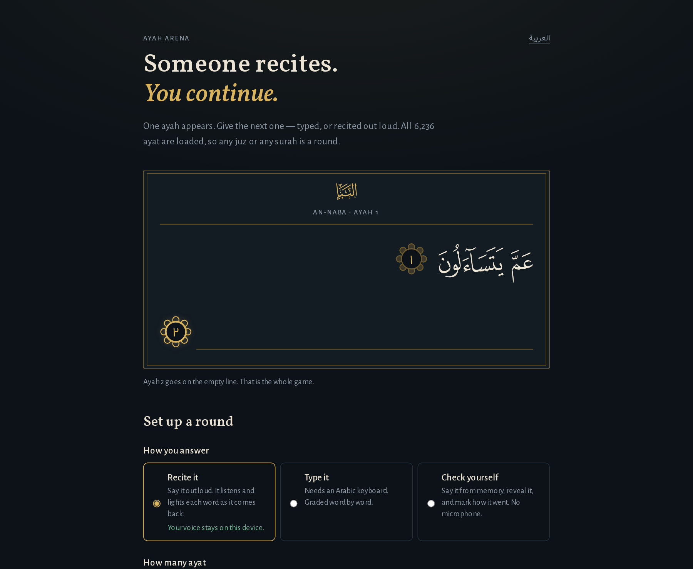

# Ayah Arena

[العربية](README.ar.md)

A social Quran recitation-challenge webapp: one ayah appears, you give the next one.



**Phase 1 is built and working end to end** — solo drill mode over the whole Quran, any
juz or any surah, typed or recited, with scoring, per-round review and a session
summary. Duels, result cards, circles and spaced-repetition revision are not built yet.

## Running it

Node 22.5 or newer — progress is stored through Node's built-in `node:sqlite`, which does
not exist before that. CI runs Node 22 LTS.

```bash
./start.sh            # the dev server, at http://localhost:3210
./start.sh --prod     # a production build, served the way it is deployed
./stop.sh             # stop whichever one you started
```

The server runs in its own session, so closing the terminal does not take it with it, and
its log is at `.run/server.log`. To drive it yourself instead: `npm install`, then
`npm run dev`.

Quran text is fetched once and committed to `data/`, so no API key and no network call
at runtime. All 6,236 ayat are already fetched; to refresh them:

```bash
npm run fetch:quran
```

Pass surah numbers to refresh only some (`npm run fetch:quran -- 2 112`); the index is
rebuilt from every surah file on disk either way.

Progress lands in `.data/ayah-arena.db` (SQLite, gitignored) — delete it to start over.

## Checks and tests

```bash
npm run verify
```

Typecheck, ESLint, the whole-corpus data check, unit tests, the Skylos gate, a dependency
audit and the integration tests — in that order, cheapest signal first. It needs no browser
and downloads nothing, so it stays quick enough to run before every commit.

The browser suites are separate because they build the app and drive Chromium:

```bash
npm run test:e2e            # journeys, guardrails, accessibility, the 375px layout
npm run test:e2e:listener   # the real microphone path, with the real speech model
```

| Layer | Runs | Touches |
|---|---|---|
| `npm run check` | grading and scope over all 6,236 ayat | the committed Quran data |
| `npm test` | unit tests (Vitest) | pure functions only |
| `npm run test:integration` | the real API route handlers | real SQLite, one throwaway database per test |
| `npm run test:e2e` | Playwright, desktop and 375px | a production build, its own database directory |
| `npm run test:e2e:listener` | Chromium with a recitation played into a fake microphone | the real on-device model, fetched once and cached |

No test reaches the network: `verify`'s one networked step is the dependency audit, which
asks npm about advisories. The listener suite fetches two pinned things the first time — a
recitation, verified by SHA-256, and the speech model at a pinned revision — into `.cache/`,
which is gitignored. Neither is committed: the recording is someone else's work, and the
model and its runtime files come to about 220MB.

Every push and pull request runs **Fast checks** (the `verify` list) and **Browser tests**.
The listener workflow runs nightly and on demand instead, since it is slow and needs that
model. Static analysis is [Skylos](https://github.com/duriantaco/skylos) against a reviewed
baseline — every accepted finding is justified by hand in `.skylos/REVIEW.md` — and
`npm audit --omit=dev --audit-level=high` is the dependency gate.

## How it works

**The text.** `scripts/fetch-quran.mjs` pulls the Uthmani, Imlaei and undiacritized
spellings of every ayah from the [Quran.com v4 API](https://api.quran.com/api/v4)
(Tanzil edition) into `data/surah/<n>.json`, along with the source attribution and the
fetch date. It walks every page of the paginated response and fails loudly if the count
disagrees with either the API's own total or the chapter metadata — silent truncation is
the failure mode that would otherwise go unnoticed. No ayah text is ever generated,
paraphrased or edited anywhere in this codebase.

**The layout is by surah, not by juz.** A pair is only ever two consecutive ayat of the
same surah, so the surah is the unit the app actually works in — and juz boundaries cut
straight through surahs (juz 2 opens mid-Baqarah at 2:142; 19 surahs straddle a
boundary). Juz membership is carried per ayah by the API, so `data/index.json` derives
the juz view from the same files rather than fetching it separately. An ayah is resolved
by its own key, never by looking through a juz it might not be wholly inside.

**The pairs.** `buildPairs()` only pairs ayat that share a surah and are consecutive, so
the final ayah of each run is never used as a prompt. Pairing blindly by position would
ask for the opening of the *next* surah — a different task from continuing a passage —
and in juz 30's 37 mostly-short surahs it would do so constantly. The same rule keeps a
juz drill inside its own juz: juz 2 ends at 2:252 and never asks for 2:253.

**The grading.** `src/lib/arabic.ts` normalizes both the expected ayah and the reader's
attempt the same way — strips harakat and pause marks, folds hamza forms, restores the
dagger alef as a long vowel, collapses shadda-doubled letters. `src/lib/score.ts` then
aligns the two word sequences (Needleman-Wunsch) and reports what came back.

A reader cannot type Uthmani orthography on a phone keyboard, so all three spellings the
data file carries — Uthmani, Imlaei and undiacritized — are accepted as correct and the
best result is kept. The three genuinely differ: the dagger alef is written out in some
words and absent in others, and no local rule reconciles them. `npm run check` verifies
that each of the three scores 100% on all 6,236 ayat — not on a sample, since juz 30
does not exercise the disconnected letters that stand as whole ayat, the long madd
forms, or most of the wasla the rest of the mushaf is full of.

Whichever spelling was typed, the ayah shown back is always the mushaf one. Someone
memorizing hifz should never be handed the answer in a script their mushaf does not use.

Asking to be shown an ayah is recorded as a skip rather than a blank answer, and skips
stay out of every accuracy figure.

**Three ways to answer.** Type it (needs an Arabic keyboard), recite it with the device
listening, or check yourself — say it from memory, reveal the ayah, and mark how it went.
The third needs no microphone and no download, and it is how the app works for anyone who
would rather not be recorded at all.

**Reciting out loud happens on the device.** With the reader's consent — asked for before
anything is downloaded — a Whisper fine-tune for Quranic Arabic is fetched once and run in
the browser. It exists to answer one question: which of the expected words came back. The
audio is never uploaded or stored, the transcript is graded and discarded rather than shown,
and the result only pre-selects a self-grade that the reader can overrule. It does not judge
tajweed or pronunciation, and it never generates text of its own.

**Gentleness is in the scoring function, not just the copy.** A word within one edit of
the expected word still earns 75% credit. Speed is a small bonus on top of accurate
recall and never a penalty. Nothing in the UI is red, nothing is struck through, and
there is no streak counter or "last active" date in the schema — a reader who takes a
week off has broken nothing.

## Layout

```
data/surah/<n>.json       verified Quran text + source attribution (committed)
data/index.json           surah + juz metadata for the picker, derived from the above
scripts/fetch-quran.mjs   the only thing that talks to the Quran API
scripts/check-scoring.ts  normalization + scoring checks against real data
src/lib/arabic.ts         normalization (grading only — never touches display)
src/lib/score.ts          word alignment and gentle credit
src/lib/quran.ts          data loading, scope resolution, prompt/answer pairs
src/components/ScopePicker.tsx   choosing among 30 juz and 114 surahs
src/lib/drill.ts          round orchestration, server-authoritative
src/lib/store.ts          all persistence, the one file a Postgres swap touches
src/lib/listen/           the on-device listener: recorder and model worker
src/lib/i18n.ts           both dictionaries; the language lives in a cookie
src/app/                  home, drill, results, API routes
tests/integration/        real route handlers against real SQLite
tests/e2e/                Playwright: journeys, guardrails, accessibility, layout
scripts/listener-fixtures.mjs   pinned recitation + model revision for the listener suite
.github/workflows/        CI (fast checks, browser tests) and the listener workflow
```

## Decisions worth knowing

- **Next.js 15 + SQLite via Node's built-in `node:sqlite`** — no native modules, no
  external database to run. Every query lives in `src/lib/store.ts` so moving to
  Postgres for duels and circles means rewriting one file.
- **No accounts yet.** Identity is one opaque `httpOnly` cookie. There is nothing to
  sign in to and nothing personal stored until duels need it.
- **The answer never reaches the client before the attempt is submitted.** The Quran is
  not secret, but a server-authoritative round is what makes duels fair later without
  reworking this layer. Recite-aloud mode has an explicit reveal endpoint, restricted
  to that mode.
- **Attempts record `{mode, rawInput, selfGrade, accuracy, points, elapsedMs}` per
  ayah** — exactly what the spaced-repetition queue will need, so phase 5 does not
  start with a migration.
- **The tab and home-screen name are just "Arena".** Many readers share a phone.
- **Two languages, and the choice lives in a cookie.** English and Arabic (RTL, Arabic-Indic
  numerals), not a URL segment, so a shared link opens in the recipient's own language.
- **The only model runs on the reader's device, and only to match words.** Nothing here
  generates religious content of any kind — no tajweed judgement, no rulings, no
  explanations.

## What's next

In the order the brief sets out: shareable result cards, async duels, circles and group
leaderboards, then spaced-repetition revision.

## Text source

Quran text via [Quran.com](https://quran.com) (Tanzil.net Uthmani edition). Surah names
and metadata from the same API.

## License

Free for personal, educational, and other non-commercial use — see [LICENSE](LICENSE) for the
full terms. Commercial use requires separate written permission from the copyright holder.
